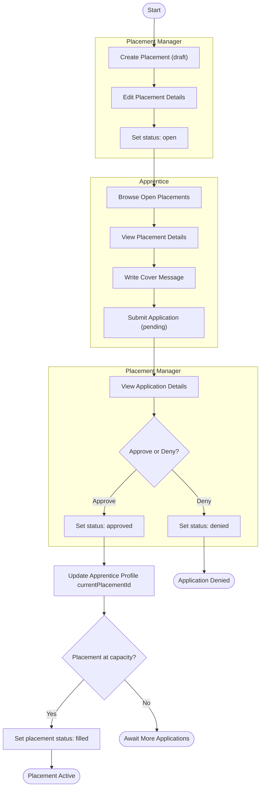
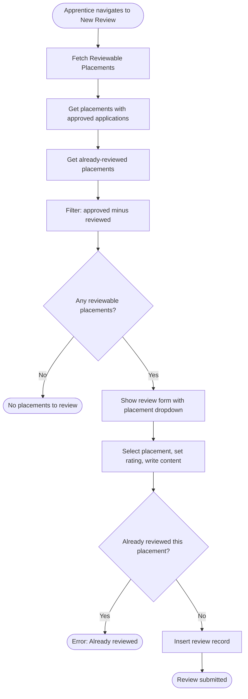
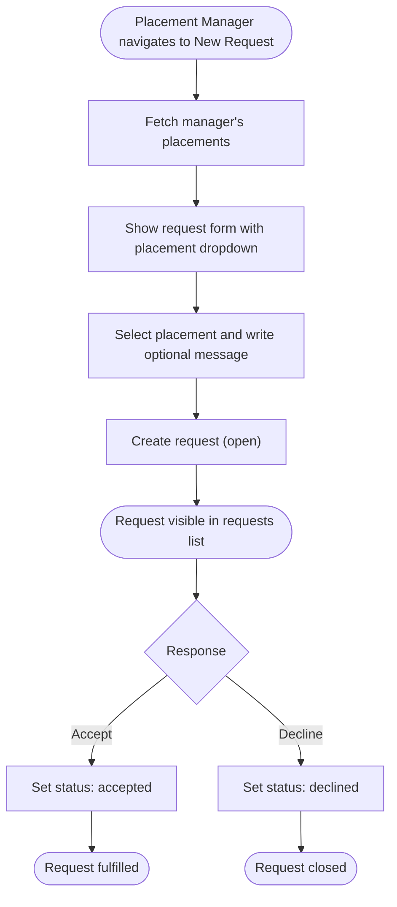
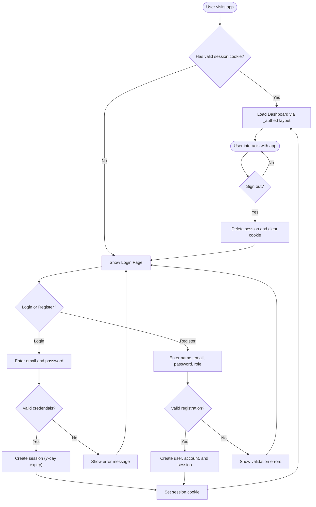

# Activity Diagrams

Shows the end-to-end workflows across multiple actors.

## 1. Placement Application Workflow

The full lifecycle from placement creation to apprentice assignment.

## 2. Review Submission Workflow

How an apprentice submits a review after completing a placement.

## 3. Apprentice Request Workflow

A placement manager requests apprentices for their placements.

## 4. Authentication Flow

The complete user authentication lifecycle.

