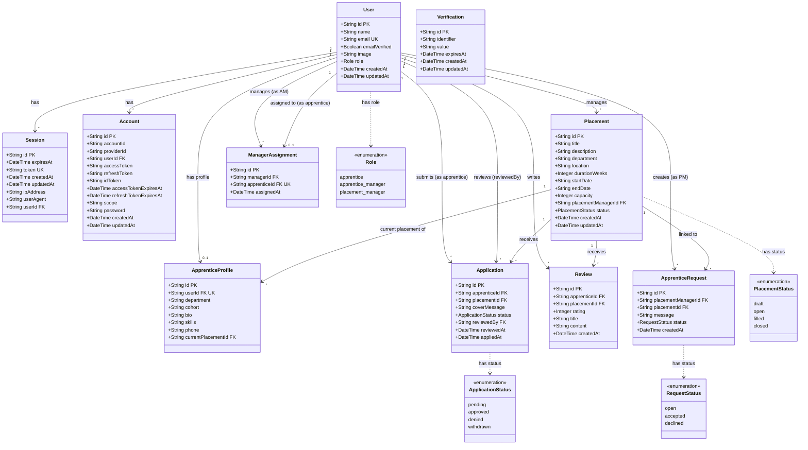

# Class Diagram

Shows all domain entities, their attributes, and relationships.

## Relationship Summary

| Relationship | Cardinality | Description |
|---|---|---|
| User → Session | 1 to many | Each user can have multiple active sessions (cascade delete) |
| User → Account | 1 to many | Each user has at least one credential account (cascade delete) |
| User → ApprenticeProfile | 1 to 0..1 | Apprentices have one optional profile (cascade delete) |
| User → Placement | 1 to many | Placement managers create and own placements |
| User → Application (apprentice) | 1 to many | Apprentices submit applications |
| User → Application (reviewer) | 1 to many | Managers review applications (set null on delete) |
| User → Review | 1 to many | Apprentices write reviews |
| User → ManagerAssignment (manager) | 1 to many | Apprentice managers are assigned multiple apprentices |
| User → ManagerAssignment (apprentice) | 1 to 0..1 | Each apprentice has at most one manager assignment |
| User → ApprenticeRequest | 1 to many | Placement managers create apprentice requests |
| Placement → Application | 1 to many | Each placement receives applications (cascade delete) |
| Placement → Review | 1 to many | Each placement receives reviews (cascade delete) |
| Placement → ApprenticeRequest | 1 to many | Placement managers request apprentices for placements |
| Placement → ApprenticeProfile | 1 to many | Tracks which apprentices are currently on this placement |
