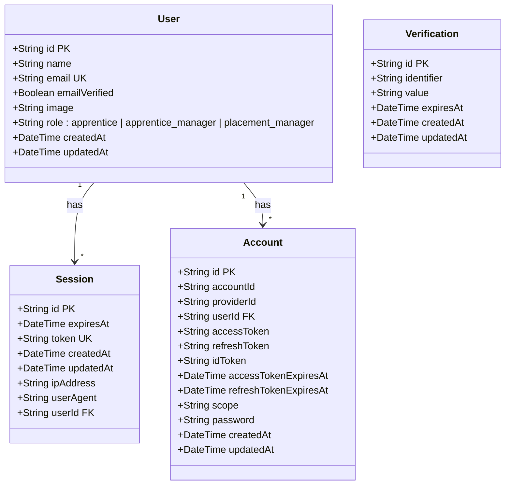
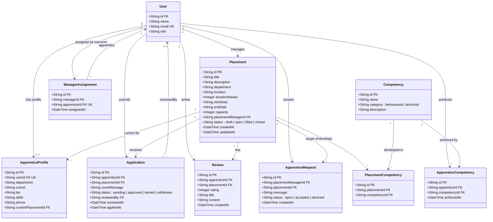

# Class Diagram

Shows all domain entities, their attributes, and relationships. Split into two diagrams to avoid overlap.

## 1. Authentication Entities

Managed by Better Auth. These tables handle user identity, credentials, and sessions.

```mermaid
classDiagram
    class User {
        +String id PK
        +String name
        +String email UK
        +Boolean emailVerified
        +String image
        +String role : apprentice | apprentice_manager | placement_manager
        +DateTime createdAt
        +DateTime updatedAt
    }

    class Session {
        +String id PK
        +DateTime expiresAt
        +String token UK
        +DateTime createdAt
        +DateTime updatedAt
        +String ipAddress
        +String userAgent
        +String userId FK
    }

    class Account {
        +String id PK
        +String accountId
        +String providerId
        +String userId FK
        +String accessToken
        +String refreshToken
        +String idToken
        +DateTime accessTokenExpiresAt
        +DateTime refreshTokenExpiresAt
        +String scope
        +String password
        +DateTime createdAt
        +DateTime updatedAt
    }

    class Verification {
        +String id PK
        +String identifier
        +String value
        +DateTime expiresAt
        +DateTime createdAt
        +DateTime updatedAt
    }

    User "1" --> "*" Session : has
    User "1" --> "*" Account : has
```

## 2. Domain Entities

The core application model: placements, applications, reviews, assignments, and requests.

```mermaid
classDiagram
    class User {
        +String id PK
        +String name
        +String email UK
        +String role
    }

    class ApprenticeProfile {
        +String id PK
        +String userId FK UK
        +String department
        +String cohort
        +String bio
        +String skills
        +String phone
        +String currentPlacementId FK
    }

    class Placement {
        +String id PK
        +String title
        +String description
        +String department
        +String location
        +Integer durationWeeks
        +String startDate
        +String endDate
        +Integer capacity
        +String placementManagerId FK
        +String status : draft | open | filled | closed
        +DateTime createdAt
        +DateTime updatedAt
    }

    class Application {
        +String id PK
        +String apprenticeId FK
        +String placementId FK
        +String coverMessage
        +String status : pending | approved | denied | withdrawn
        +String reviewedBy FK
        +DateTime reviewedAt
        +DateTime appliedAt
    }

    class Review {
        +String id PK
        +String apprenticeId FK
        +String placementId FK
        +Integer rating
        +String title
        +String content
        +DateTime createdAt
    }

    class ManagerAssignment {
        +String id PK
        +String managerId FK
        +String apprenticeId FK UK
        +DateTime assignedAt
    }

    class ApprenticeRequest {
        +String id PK
        +String placementManagerId FK
        +String placementId FK
        +String message
        +String status : open | accepted | declined
        +DateTime createdAt
    }

    class Competency {
        +String id PK
        +String name
        +String category : behavioural | technical
        +String description
    }

    class ApprenticeCompetency {
        +String id PK
        +String apprenticeId FK
        +String competencyId FK
        +DateTime achievedAt
    }

    class PlacementCompetency {
        +String id PK
        +String placementId FK
        +String competencyId FK
    }

    User "1" --> "0..1" ApprenticeProfile : has profile
    User "1" --> "*" Placement : manages
    User "1" --> "*" Application : submits
    User "1" --> "*" Review : writes
    User "1" --> "*" ManagerAssignment : assigned as manager
    User "1" --> "*" ApprenticeRequest : creates
    User "1" --> "*" ApprenticeCompetency : achieves

    Placement "1" --> "*" Application : receives
    Placement "1" --> "*" Review : has
    Placement "1" --> "*" ApprenticeRequest : target of
    Placement "1" --> "*" ApprenticeProfile : current for
    Placement "1" --> "*" PlacementCompetency : develops

    Competency "1" --> "*" ApprenticeCompetency : achieved by
    Competency "1" --> "*" PlacementCompetency : developed in

    Application "*" --> "0..1" User : reviewedBy
    ManagerAssignment "*" --> "1" User : apprentice
```

## Relationship Summary

| Relationship | Cardinality | Description |
|---|---|---|
| User → Session | 1 to many | Each user can have multiple active sessions (cascade delete) |
| User → Account | 1 to many | Each user has at least one credential account (cascade delete) |
| User → ApprenticeProfile | 1 to 0..1 | Apprentices have one optional profile (cascade delete) |
| User → Placement | 1 to many | Placement managers create and own placements |
| User → Application (submits) | 1 to many | Apprentices submit applications |
| User → Application (reviewedBy) | many to 0..1 | Managers review applications (set null on delete) |
| User → Review | 1 to many | Apprentices write reviews |
| User → ManagerAssignment (manager) | 1 to many | Apprentice managers oversee multiple apprentices |
| User → ManagerAssignment (apprentice) | many to 1 | Each apprentice has at most one manager |
| User → ApprenticeRequest | 1 to many | Placement managers create apprentice requests |
| Placement → Application | 1 to many | Each placement receives applications (cascade delete) |
| Placement → Review | 1 to many | Each placement receives reviews (cascade delete) |
| Placement → ApprenticeRequest | 1 to many | Placement managers request apprentices for placements |
| Placement → ApprenticeProfile | 1 to many | Tracks which apprentices are currently on this placement |
| Placement → PlacementCompetency | 1 to many | Each placement develops zero or more competencies (cascade delete) |
| User → ApprenticeCompetency | 1 to many | Apprentices achieve competencies over time (cascade delete) |
| Competency → ApprenticeCompetency | 1 to many | Each competency can be achieved by many apprentices (cascade delete) |
| Competency → PlacementCompetency | 1 to many | Each competency can be developed by many placements (cascade delete) |

## Enumeration Values

| Field | Values |
|---|---|
| `User.role` | `apprentice`, `apprentice_manager`, `placement_manager` |
| `Placement.status` | `draft`, `open`, `filled`, `closed` |
| `Application.status` | `pending`, `approved`, `denied`, `withdrawn` |
| `ApprenticeRequest.status` | `open`, `accepted`, `declined` |
| `Competency.category` | `behavioural`, `technical` |
