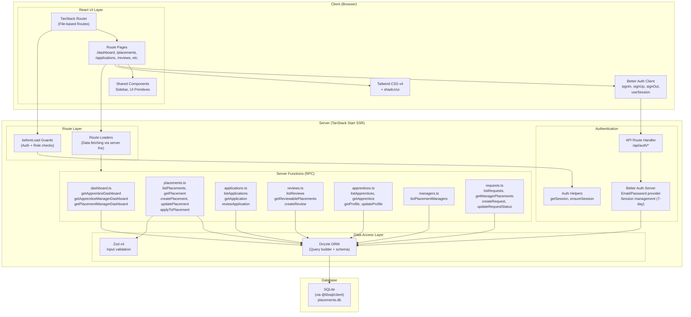

# Component Diagram

Shows the system architecture and how the major components interact.

## Layer Descriptions

| Layer | Technology | Responsibility |
|---|---|---|
| **UI** | React 19 + TanStack Router | File-based routing, page components, shared UI primitives |
| **Styling** | Tailwind CSS v4 + shadcn/ui (CVA) | Design system, responsive layout, dark/light theme |
| **Auth Client** | Better Auth Client SDK | Client-side auth methods (signIn, signUp, signOut, useSession) |
| **Route Guards** | TanStack Router `beforeLoad` | Authentication enforcement and role-based access control |
| **Server Functions** | TanStack Start `createServerFn` | Domain logic (CRUD operations, business rules, role-scoped queries) |
| **Validation** | Zod v4 | Schema-based input validation for mutations |
| **Auth Server** | Better Auth + Drizzle adapter | Session management, password hashing, cookie-based auth |
| **ORM** | Drizzle ORM | Type-safe SQL query building, schema definition, migrations |
| **Database** | SQLite via @libsql/client | Persistent storage (file-based, Turso-compatible) |
