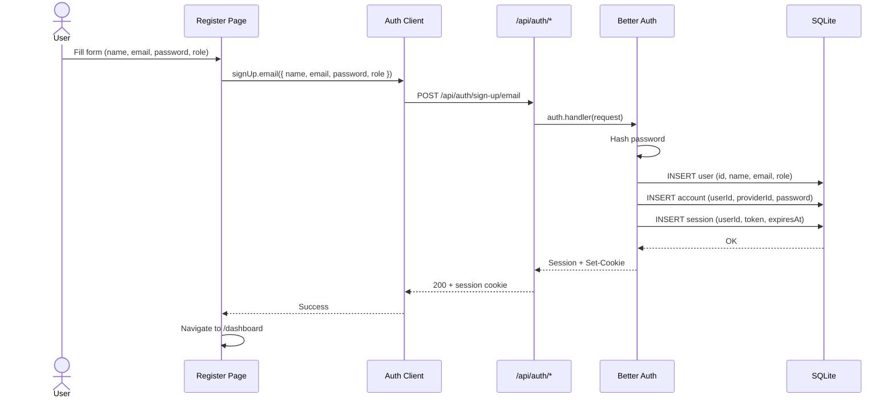
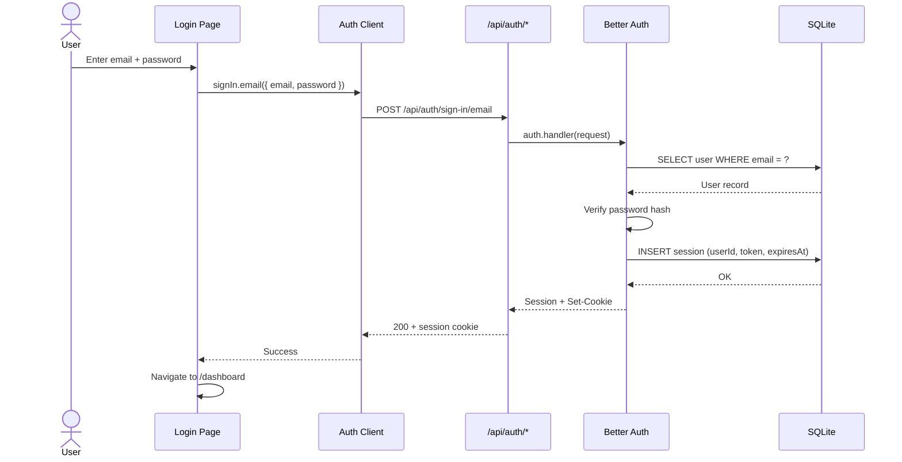
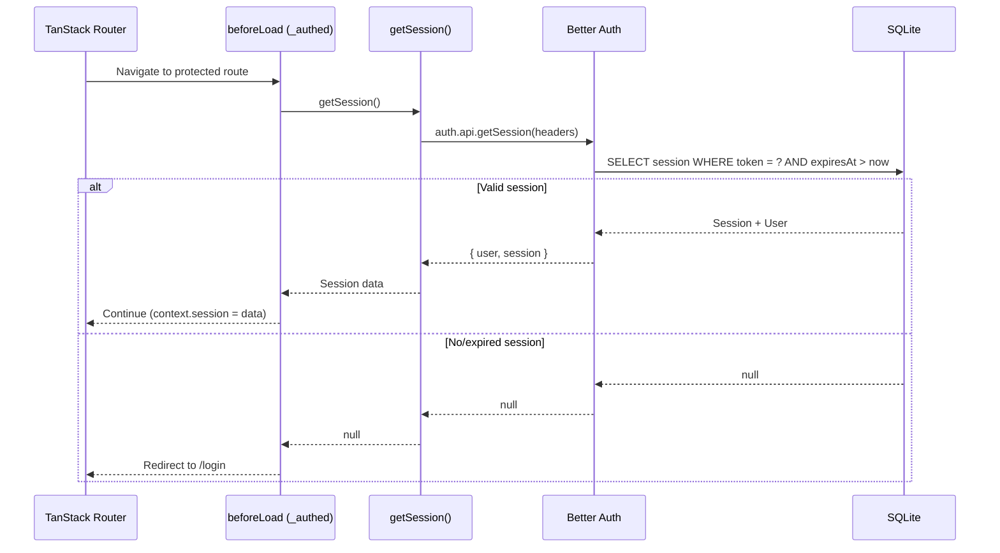
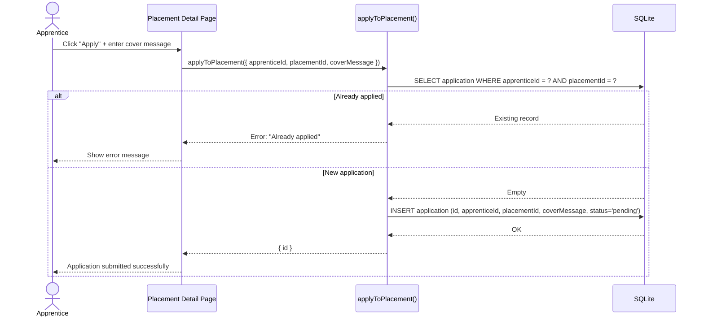
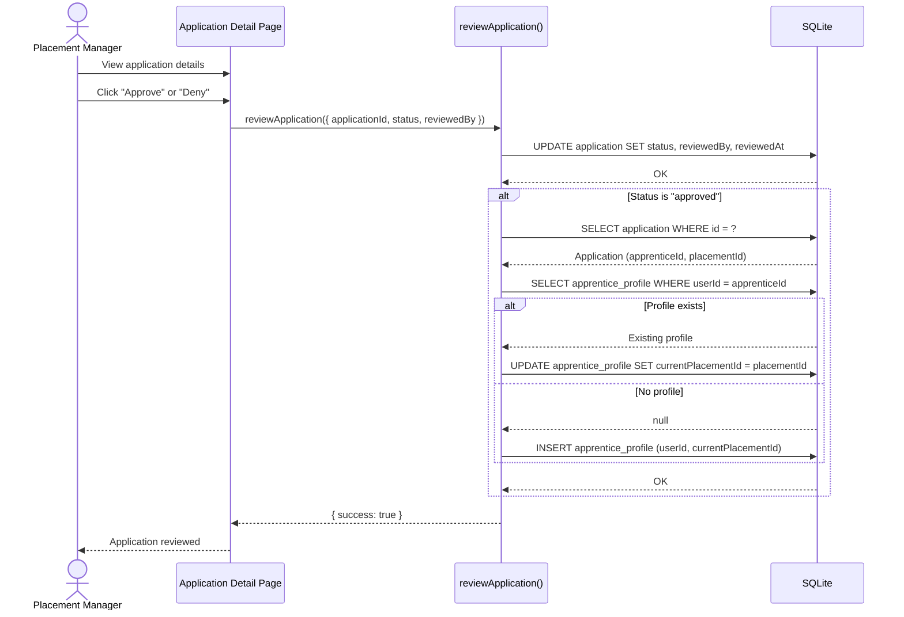
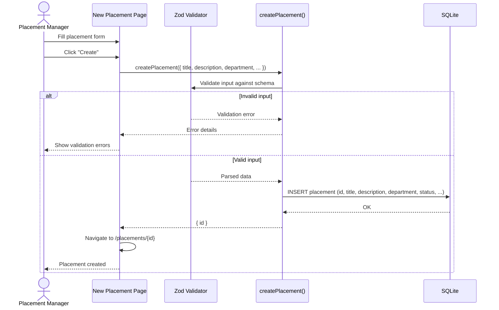
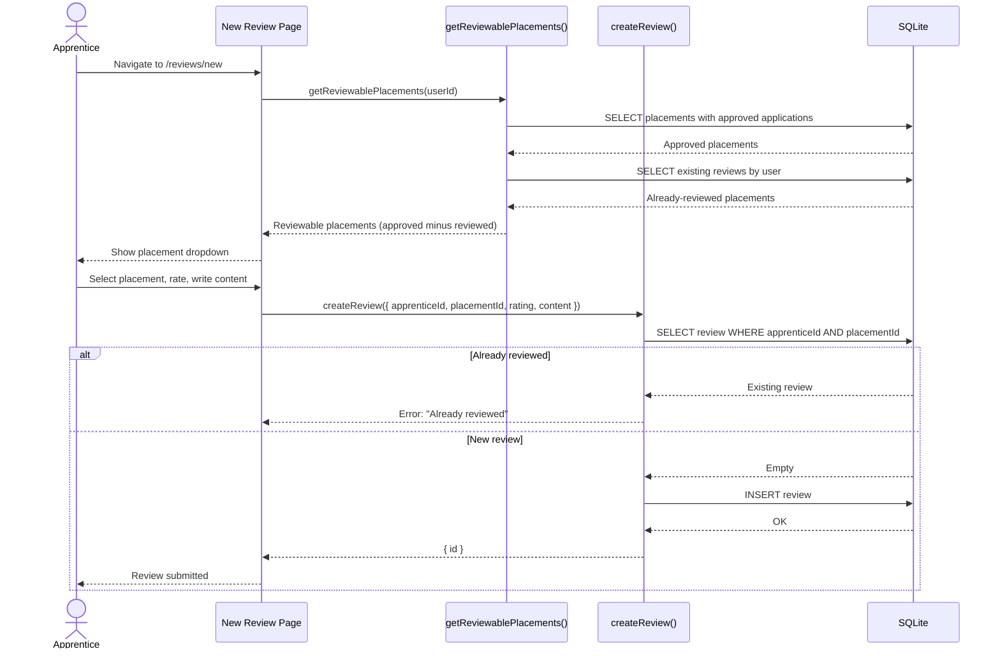

# Sequence Diagrams

Shows the flow of key operations through the system.

## 1. User Registration

## 2. User Login

## 3. Route Authentication Guard

## 4. Apprentice Applies to Placement

## 5. Placement Manager Reviews Application

## 6. Create Placement

## 7. Apprentice Writes Review

