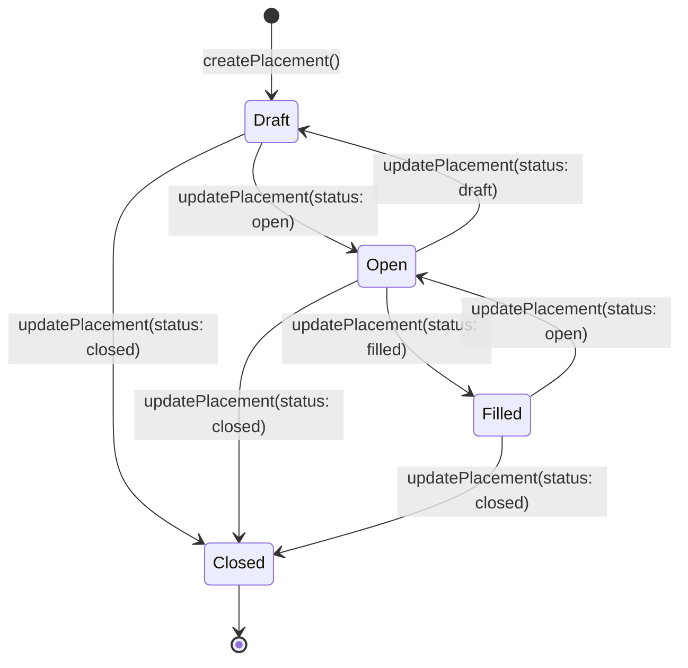
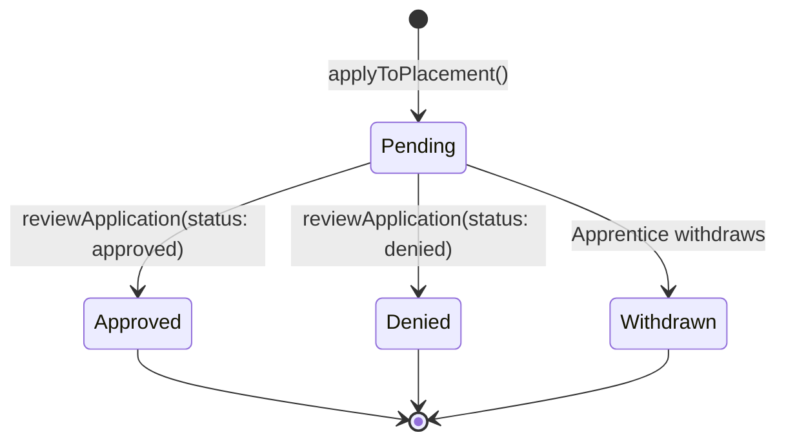
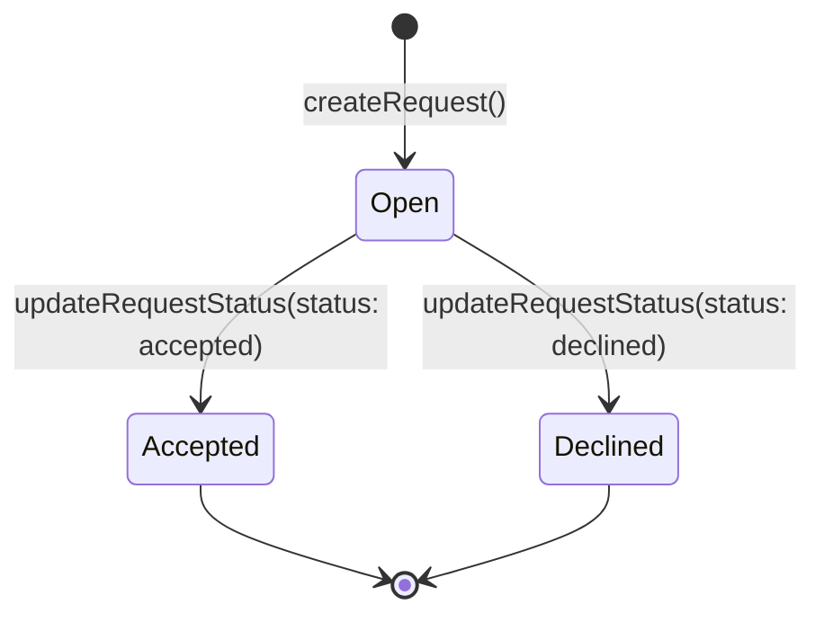

# State Diagrams

Shows the lifecycle state transitions for key domain entities.

## 1. Placement Status

A placement moves through its lifecycle from creation to closure. While in **draft**, it is only visible to its placement manager for editing. Once **open**, apprentices can browse and apply. When all capacity is filled, it moves to **filled**. A **closed** placement is completed or cancelled.

## 2. Application Status

An application moves from submission through to a final decision. When **pending**, it awaits review by the placement manager. On **approval**, the apprentice's profile is automatically updated with `currentPlacementId`. A **denied** application is rejected. An apprentice may also **withdraw** their own application.

### Approval Side Effect

When an application is approved, the system automatically:
1. Looks up the apprentice's profile
2. If a profile exists: updates `currentPlacementId` to the approved placement
3. If no profile exists: creates a new profile with `currentPlacementId` set

## 3. Apprentice Request Status

A placement manager creates a request for an apprentice to fill one of their placements. The request starts as **open** and can be **accepted** (fulfilled) or **declined**.

## State Summary Table

| Entity | States | Transitions | Triggered By |
|---|---|---|---|
| **Placement** | `draft` → `open` → `filled` → `closed` | `updatePlacement()` | Placement Manager |
| **Application** | `pending` → `approved` / `denied` / `withdrawn` | `reviewApplication()` | Placement Manager (approve/deny), Apprentice (withdraw) |
| **ApprenticeRequest** | `open` → `accepted` / `declined` | `updateRequestStatus()` | System / Apprentice Manager |
