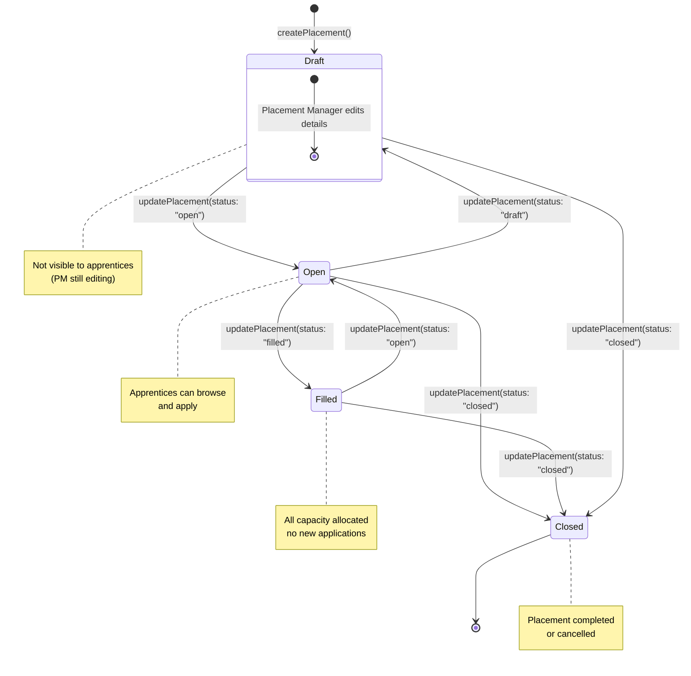
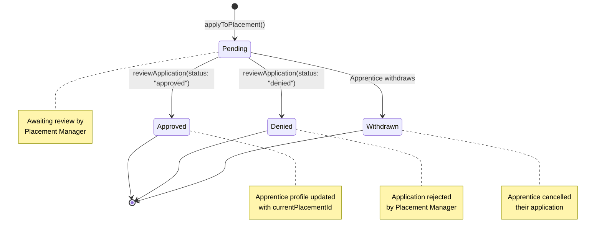
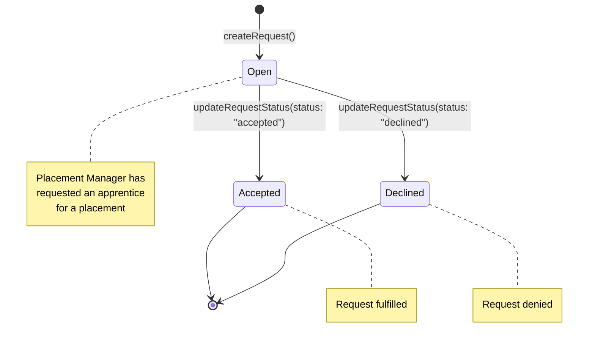

# State Diagrams

Shows the lifecycle state transitions for key domain entities.

## 1. Placement Status

A placement moves through its lifecycle from creation to closure.

## 2. Application Status

An application moves from submission through to a final decision.

### Approval Side Effect

When an application is approved, the system automatically:
1. Looks up the apprentice's profile
2. If a profile exists: updates `currentPlacementId` to the approved placement
3. If no profile exists: creates a new profile with `currentPlacementId` set

## 3. Apprentice Request Status

A placement manager requests an apprentice for one of their placements.

## State Summary Table

| Entity | States | Transitions | Triggered By |
|---|---|---|---|
| **Placement** | `draft` → `open` → `filled` → `closed` | `updatePlacement()` | Placement Manager |
| **Application** | `pending` → `approved` / `denied` / `withdrawn` | `reviewApplication()` | Placement Manager (approve/deny), Apprentice (withdraw) |
| **ApprenticeRequest** | `open` → `accepted` / `declined` | `updateRequestStatus()` | System / Apprentice Manager |
