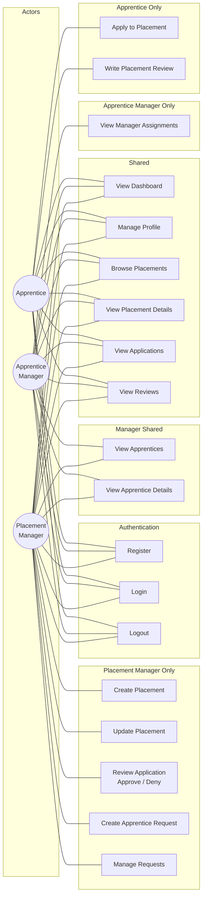

# Use Case Diagram

Shows the interactions each actor role has with the Placements system.

## Use Case Descriptions

| Use Case | Actor(s) | Description |
|---|---|---|
| Register | All | Create an account with name, email, password, and role |
| Login | All | Authenticate with email and password |
| Logout | All | End current session |
| View Dashboard | All | Role-specific summary (stats, recent activity) |
| Manage Profile | All | View and update profile info (bio, skills, phone, department) |
| Browse Placements | All | List placements with optional status filter |
| View Placement Details | All | See full placement info and its applications |
| View Applications | All | Role-scoped application list (own, managed, or owned placements) |
| View Reviews | All | Role-scoped review list |
| Apply to Placement | Apprentice | Submit a cover message to apply for an open placement |
| Write Placement Review | Apprentice | Rate and review an approved placement (one per placement) |
| View Apprentices | AM, PM | List apprentice users and their profiles |
| View Apprentice Details | AM, PM | See individual apprentice profile and current placement |
| View Manager Assignments | AM | See which apprentices are assigned to which managers |
| Create Placement | PM | Draft a new placement listing |
| Update Placement | PM | Edit placement details or change status |
| Review Application | PM | Approve or deny an application (auto-assigns on approval) |
| Create Apprentice Request | PM | Request an apprentice for a specific placement |
| Manage Requests | PM | View and update status of apprentice requests |
