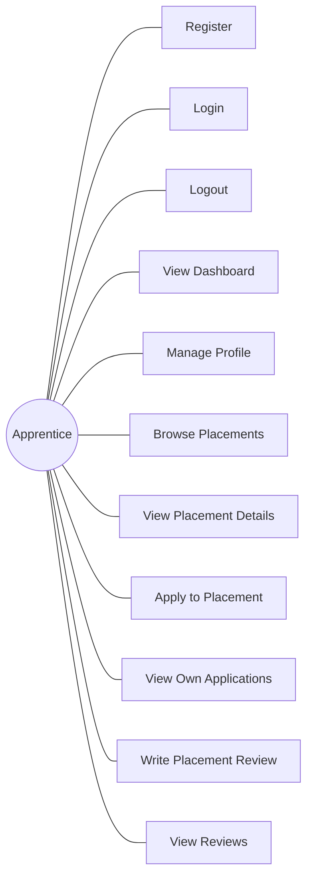
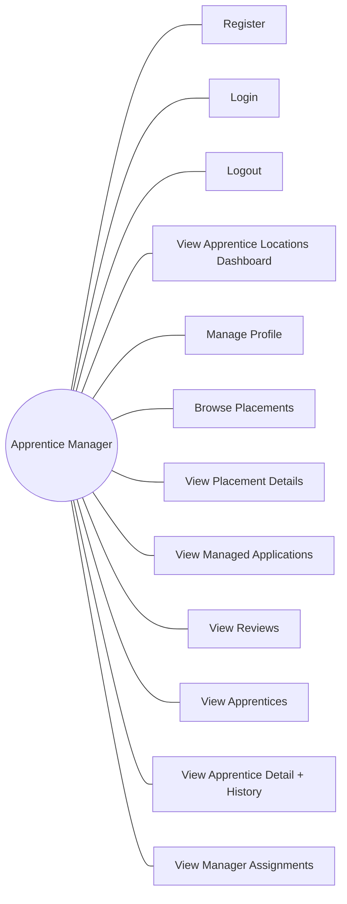
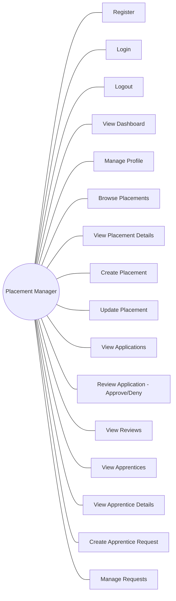

# Use Case Diagrams

Shows the interactions each actor role has with the Placements system. Split by role to avoid edge overlap.

## 1. Apprentice

## 2. Apprentice Manager

## 3. Placement Manager

## Use Case Summary

| Use Case | Apprentice | Apprentice Manager | Placement Manager |
|---|:---:|:---:|:---:|
| Register / Login / Logout | x | x | x |
| View Dashboard | x | x (apprentice locations, desired next placements) | x |
| Manage Profile | x | x | x |
| Browse Placements | x | x | x |
| View Placement Details | x | x | x |
| View Applications | x (own) | x (managed) | x (own placements) |
| View Reviews | x | x | x |
| Apply to Placement | x | | |
| Write Placement Review | x | | |
| View Apprentices | | x | x |
| View Apprentice Details + History | | x | x |
| View Manager Assignments | | x | |
| Create Placement | | | x |
| Update Placement | | | x |
| Review Application (Approve/Deny) | | | x |
| Create Apprentice Request | | | x |
| Manage Requests | | | x |
